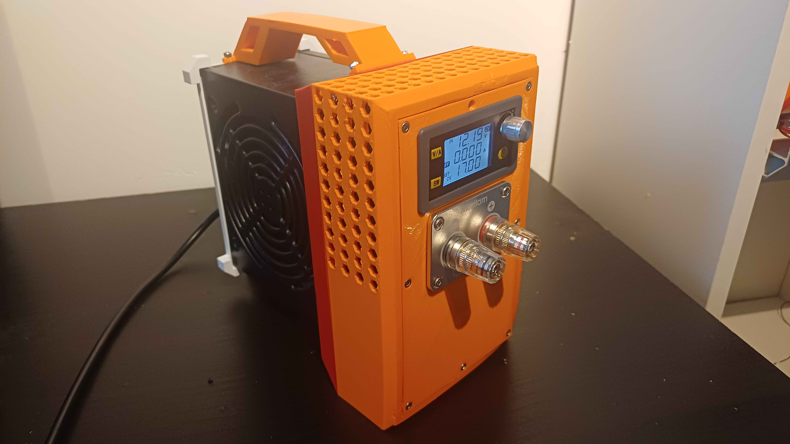

# ATX-Variable-PSU
DIY variable power supply using an ATX PSU and buck converter.

## Features
---

* Voltage: 0-50V
* Amperage: 8A
* Repurposing ATX PSU
* Low-cost

## Parts list
---
| Qty | Component               | Notes                          | Link |
|-----|--------------------------|--------------------------------|------------------|
| 1   | ATX Power Supply                        | Corsair CV650                 | [Product page](https://www.corsair.com/us/en/p/psu/cp-9020211-na/cv-series-cv650-650-watt-80-plus-bronze-certified-psu-cp-9020211-na) |
| 1   | Buck Converter Module                   | XY5008E from Aliexpress       | [Product page](https://www.aliexpress.com/item/1005005247897362.html) |
| 1   | Banana Plug Connectors                  | 1 red, 1 black                | [Product page](https://www.aliexpress.com/item/1005006516519813.html) |
| 1   | Enclosure                               | 3D printed (see Fusion file)  | [Mechanical (Fusion 360 + STL)](mechanical/)   |
| 1   | XT90 Female Connector                   | High current output connector | [Product page](https://www.aliexpress.com/item/1005007620266465.html) |
| 1   | XT90 Male Plug                          | High current plug             | [Product page](https://www.aliexpress.com/item/1005008308472728.html) |
| 1   | 4mm Banana plug to alligator clip       | Standard test leads           | [Product page](https://www.aliexpress.com/item/1005006537881871.html) |
| —   | Wires, Heat Shrink, etc.                | For connections               | — |